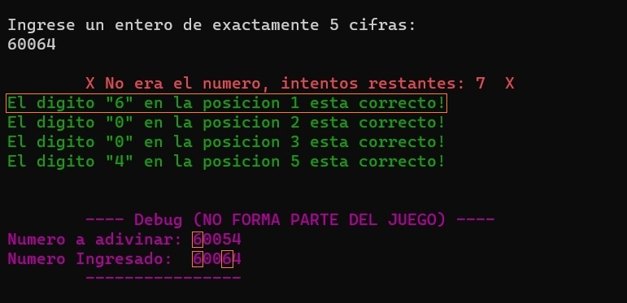
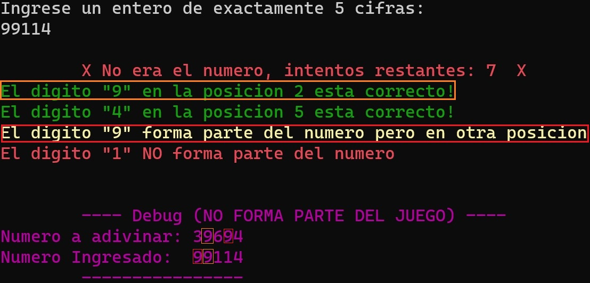

 
Licenciatura en Informática 
Sede Puerto Madryn 
Algorítmica y Programación</u> 
Fecha: 29/09/2023   
Trabajo Integrador Nº1 
Alumnos: 
Andres, Ariel Sebastian. 
Bonansea Camaño, Mariano Nicolas. 
Cordoba,Tahiel Luis. 
Rivero, Lucia Jazmin. 

 
 
 
 
 
 
Aclaraciones: 

* Se adjunta tanto codigo "TpInt_Andres,Bonansea,Cordoba,Rivero.c" como archivo ya compilado "TpInt_Andres,Bonansea,Cordoba,Rivero.exe".

* El Programa se encuentra pensado y probado para un entorno windows, ya que este utiliza la libreria "Windows.h" para poner colores en la terminal.

* El texto violeta que dice "---- Debug (NO FORMA PARTE DEL JUEGO) ----" (en la terminal) esta colocado para facilitar las pruebas (y la correccion) del juego aportando la respuesta del numero generado aleatoriamente. El mismo puede ser removido en cualquier momento sin afectar al resto del programa.

* El programa fue construido de manera tal que se pueda alternar ciertos parametros en las constantes definidas modificando sus valores y sin afectar a la jugabilidad (Como la cantidad de jugadores a mostrar en el ranking, digitos del numero, cantidad de intentos, etc.), con el objetvo de poder hacer el juego mas moldeable a ciertas preferencias (por defecto estas corresponden a las consignas del trabajo integrador). 

* Se asume que el usuario colocara el TIPO de dato correspondiente en cada ingreso de datos (el cual se encuentra aclarado en cada caso) solicitado ya que las validaciones pueden romperse si se coloca otro tipo (por ejemplo en el ingreso de la opcion de jugar nuevamente si se selecciona un numero de opcion distinto de 0 o 1 (si o no) la validacion funciona y vuelve a solicitar el ingreso del usuario, pero si este coloca un string o un char la validacion se rompe). 

* En el ingreso del intento del jugador por adivinar el numero no se permite que el numero comience con ceros (00345 por ejemplo), ya que debido al ingreso de enteros por "scanf()" estos no se consideran como digitos, lo que no permite pasar la validacion de colocar un numero de exactamente 5 cifras. Igualmente cabe aclarar que ningun numero a adivinar generado aleatoriamente inicializara con ceros adelante para solventar este inconveniente. 

* El unico "caso de acierto parcial/no acierto" No contemplado es cuando se colocan dos digitos identicos en el ingreso del jugador (dos "6" en el ejemplo) y uno de ellos coincide en posicion exacta, pero el otro no, y en el numero a adivinar no existe otra aparicion del mismo.  
En este caso lo unico que se muestra es que el digito esta en la posicion correcta y no se hace referencia al otro digito identico ingresado. Lo consideramos de esta manera ya que sino generaria confusion cuando exista otra aparicion del mismo digito en el numero a adivinar (ver imagen Ejemplo 1 y 2) 

Ejemplo 1: 
 

Cabe aclarar que en el caso de que exista otra aparicion del digito identico pero en otra ubicacion ambas se detallaran como es correcto, lo que se muestra a continuacion: 

Ejemplo 2: 
   